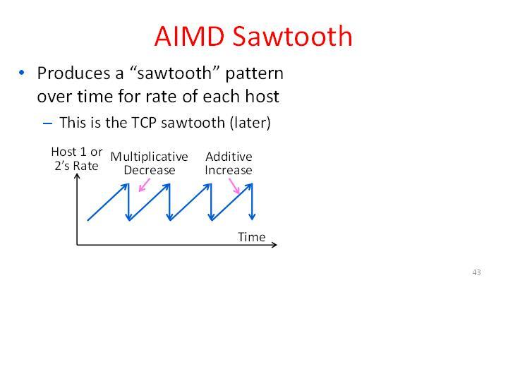

# Tutorial

In this tutorial, we'll walk through the process of implementing a very simple congestion control algorithm in CCP and then running and debugging that implementation in an emulator.

We'll be using **Portus v0.3.3**. The first part covering algorithm implementation is agnostic to datapath, but for the second part we'll be using the **Linux Kernel datapath**. Please let us know if you run into any problems during this tutorial by submitting a GitHub issue.

The focus here is to explain the CCP programming model, so we'll be implementing a very simple scheme: AIMD (additive-increase multiplicative-decrease). Before we even start talking about CCP, let's briefly go over exactly how the algorithm works and what kind of behavior we expect to see. We assume a basic familiarity with the problem of congestion control. If you need some background, [Van Jacobson's paper](http://web.mit.edu/6.829/www/currentsemester/papers/vanjacobson-congavoid.pdf) is a good place to start.

### AIMD Scheme

The high-level idea is to start with a low cwnd, and then as ACKs are received, probe for more bandwidth by continually increasing the cwnd (additively) until eventually a loss occurs, which signals congestion. We then cut our rate (multiplicatively) and repeat. If you were to graph the congestion window over time of a single flow running this scheme in the prescence of a droptail buffer, it would exhibit the classic "sawtooth" behavior:

Specifically, we'll use the following algorithm:

-   On each ACK, increase CWND by 1/cwnd (this has the affect of increasing the cwnd by roughly 1 packet per RTT)
-   On each loss, cut CWND by 1/2

